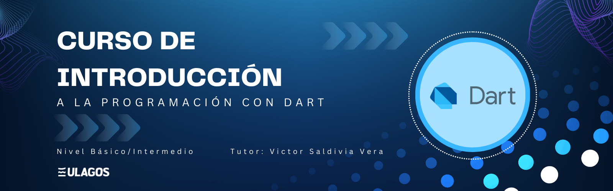

# Repositorio Nivel Básico Dart

## Descripción del Proyecto

Este repositorio contiene información para trabajar con el lenguaje de programación
Dart desde cero. 

Incluye uso de variables, tipos de datos, funciones, condicionales y ciclos. 
Con el objetivo de conocer un poco más este grandioso lenguaje de programación

Con ejemplos de diferentes algoritmos, el aprendizaje será mas fácil.

Este repositorio e irá actualizando a medida del avance del curso este 2023.

## Enlaces de Interés

- Web oficial de Dart [(Instalacion Dart)][dart]
- Visual Studio Code [(Editor de Texto)][vscode]

[dart]: https://dart.dev/get-dart
[vscode]: https://code.visualstudio.com/download
